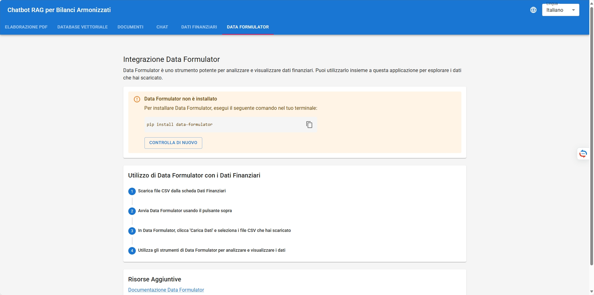
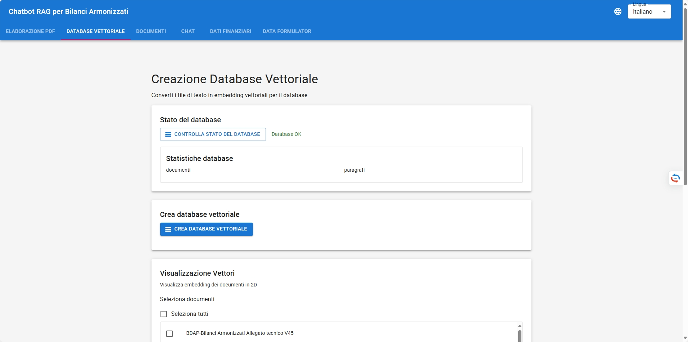
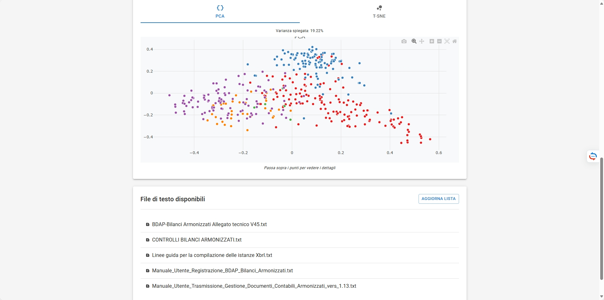
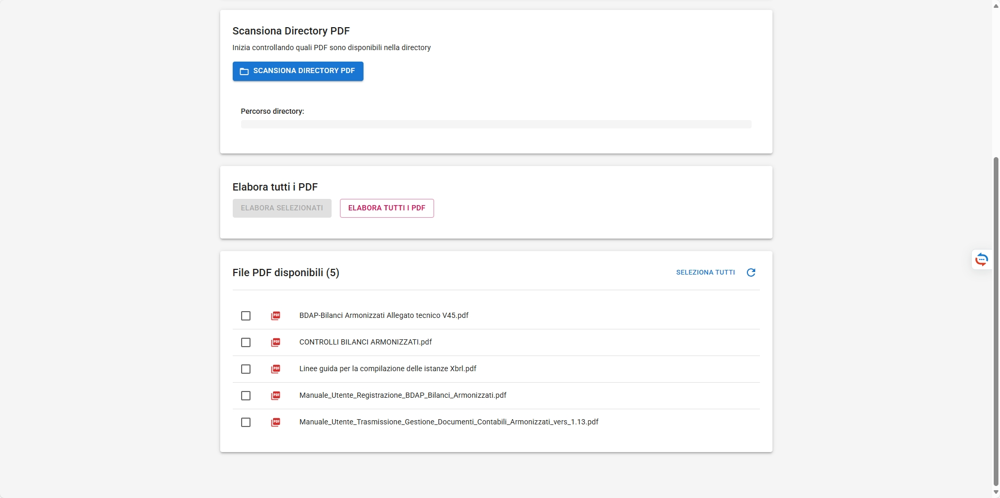
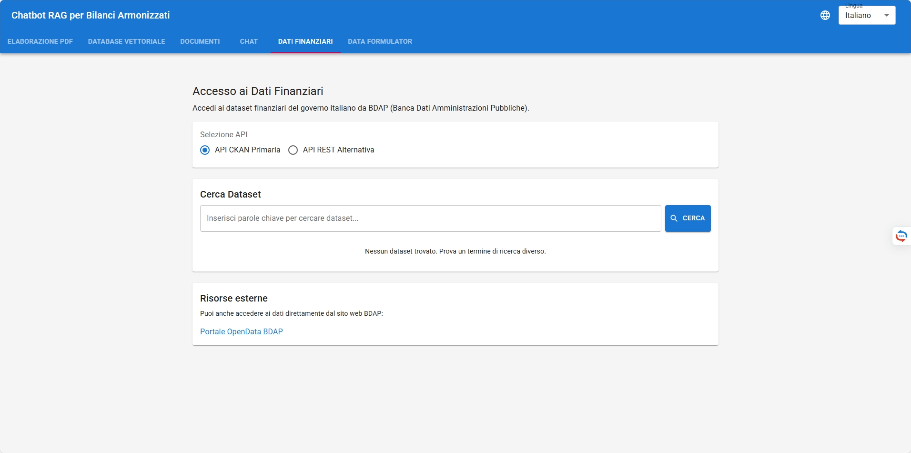
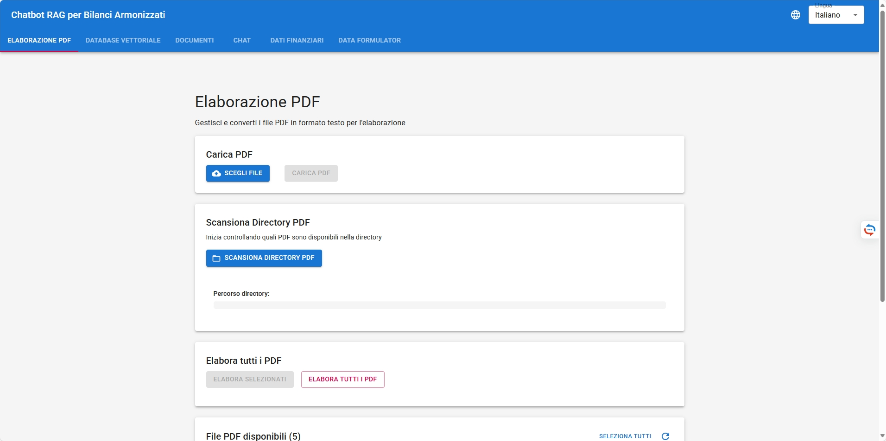
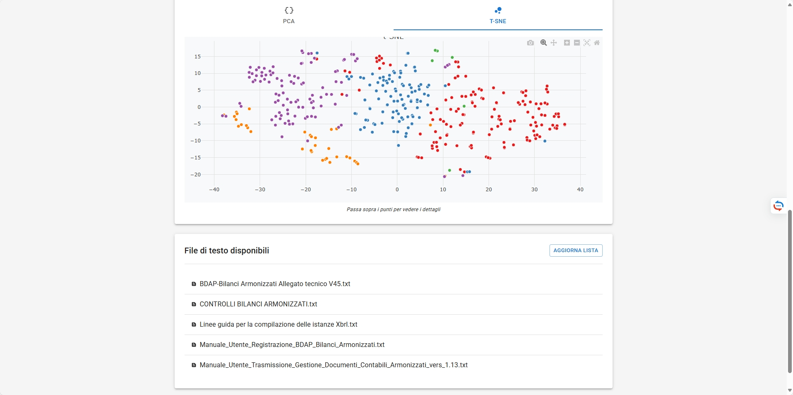
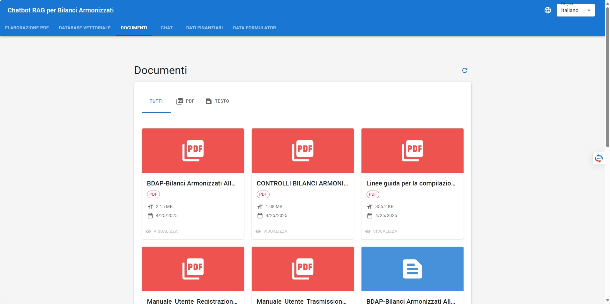
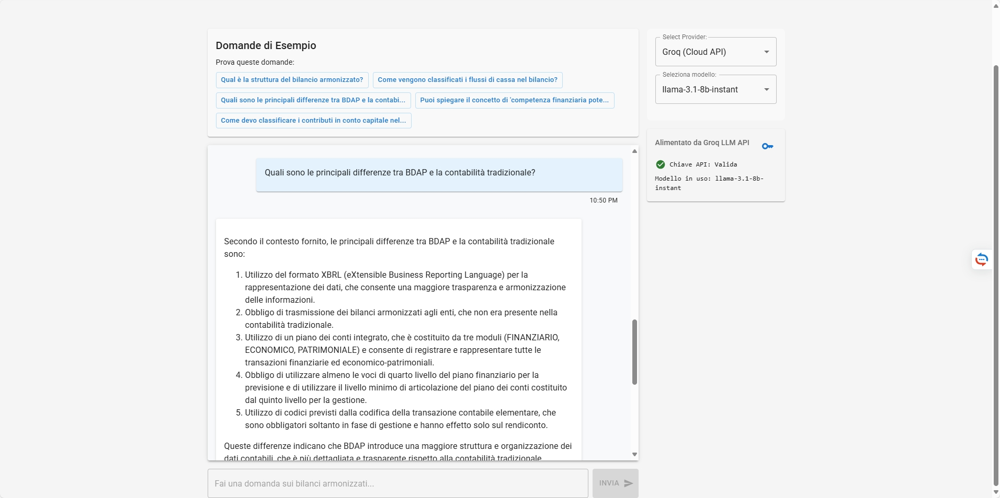

# RAG Chat With Data Science: Retrieval-Augmented Generation

[](https://opensource.org/licenses/Apache-2.0)

## Created by [Learn By Doing With Steven](https://www.youtube.com/c/LearnByDoingWithSteven)

This application provides a Retrieval-Augmented Generation (RAG) system for querying Bilanci Armonizzati documents from BDAP (Banca Dati Amministrazioni Pubbliche). It utilizes a modern React frontend with a FastAPI backend, supporting both cloud-based (Groq) and local (Ollama) language models.

## Features

- **Multi-Model Support**: Use either cloud-based Groq models or local Ollama models
- **Document Processing**: Automatically process PDF files into searchable text
- **Vector Database**: Store and search document embeddings for semantic similarity
- **RAG Architecture**: Provide context-aware answers based on document content
- **Interactive UI**: Modern React frontend with Material-UI components
- **Robust Error Handling**: Graceful degradation when services are unavailable

## Directory Structure

```
react-version/
├── app/                    # Backend Python code
│   ├── api/                # API endpoints
│   ├── core/               # Core configuration
│   ├── db/                 # Database operations
│   ├── models/             # Pydantic models
│   └── services/           # Business logic services
├── react-frontend/         # Frontend React code
├── bilanci_pdf/            # Storage for uploaded PDF files
├── bilanci_text/           # Storage for extracted text files
└── vectordb/              # Vector database storage
    └── embeddings.db       # SQLite database with embeddings
```

## Setup and Installation

### Backend Requirements

1. Python 3.9+ with pip
2. Required packages (install with `pip install -r requirements.txt`):
   - fastapi
   - uvicorn
   - pydantic
   - groq
   - sentence-transformers
   - scikit-learn
   - pandas
   - numpy
   - PyPDF2

### Frontend Requirements

1. Node.js 14+ with npm
2. Required packages (install with `npm install` in the react-frontend directory)

### Optional Requirements

- Ollama (for local model support): Install from [ollama.ai](https://ollama.ai)

## Configuration

### API Keys

1. **Groq API Key**: Obtain from [groq.com](https://console.groq.com/keys)
2. Set the API key in one of these ways:
   - Environment variable: `GROQ_API_KEY=your_key_here`
   - Save to a file: `.groq_api_key` in the application root
   - Set through the UI: Settings -> API Key

### Ollama Configuration

1. Install Ollama from [ollama.ai](https://ollama.ai)
2. Pull desired models: `ollama pull llama3.1` (or any other model)
3. Ensure Ollama is running on the default port (11434)

## Usage Workflow

### 1. Starting the Application

#### Backend

```bash
cd react-version
python -m app.main
```

The backend will start on http://localhost:8000

#### Frontend

```bash
cd react-version/react-frontend
npm start
```

The frontend will start on http://localhost:3000

### 2. Document Processing

1. **Upload Documents**:
   - Navigate to the "Documents" tab
   - Click "Upload PDF" to add new documents
   - Files will be stored in the `bilanci_pdf` directory

2. **Process Documents**:
   - Select documents to process
   - Click "Process Selected" to extract text
   - Extracted text is stored in the `bilanci_text` directory

### 3. Vector Database Creation

1. **Create Vector Database**:
   - Navigate to the "Database" tab
   - Click "Create Vector Database"
   - This processes all text files into embeddings
   - The database is stored in `vectordb/embeddings.db`

2. **Check Database Status**:
   - The status will show the number of documents and paragraphs
   - You can visualize the embeddings with the "Visualize" button

### 4. Chat Interface

1. **Select Model Provider**:
   - Choose between "Groq" (cloud) or "Ollama" (local)
   - For Groq: Enter your API key if not already configured
   - For Ollama: Ensure Ollama is running with available models

2. **Select Model**:
   - Groq: Choose from production models, preview models, or systems
   - Ollama: Choose from locally available models

3. **Ask Questions**:
   - Type questions in the chat interface
   - The system will:
     - Find relevant context from the document database
     - Send the context with your question to the selected LLM
     - Display the answer with source references

## Error Handling

The application includes robust error handling for common situations:

- **Missing Database**: Automatic creation of database directory
- **API Key Issues**: Clear error messages and validation
- **Unavailable Services**: Graceful fallbacks when Groq or Ollama is unavailable
- **Model Selection**: Prevents submission without a valid model
- **PDF Processing**: Proper error handling for corrupt files

## Advanced Configuration

### Environment Variables

- `GROQ_API_KEY`: Your Groq API key
- `OLLAMA_API_URL`: URL for Ollama (default: http://localhost:11434)

### Custom Models

- **Groq Models**: Configured in `app/core/config.py` under GROQ_PRODUCTION_MODELS, GROQ_PREVIEW_MODELS, and GROQ_PREVIEW_SYSTEMS
- **Ollama Models**: Automatically detected from locally available models

## Troubleshooting

1. **Groq API Issues**:
   - Verify API key validity
   - Check internet connection
   - Ensure selected model is available

2. **Ollama Issues**:
   - Verify Ollama is running with `ollama list`
   - Check if models are pulled with `ollama list`
   - Default port is 11434

3. **Vector Database Issues**:
   - Ensure text files exist in `bilanci_text`
   - Check disk space for embedding storage
   - Delete and recreate database if corrupted

4. **PDF Processing Issues**:
   - Ensure PDF files are not corrupted
   - Check write permissions to `bilanci_text` directory
   - Try processing files individually

## Architecture

### Frontend

The React frontend uses a component-based architecture with Material-UI for styling. Key components:

- **ChatTab**: Main chat interface with model selection
- **DocumentsTab**: Document management interface
- **DatabaseTab**: Vector database management

### Backend

The FastAPI backend follows a modular structure:

- **API Layer**: Routes and endpoints for client requests
- **Service Layer**: Business logic and external API integration
- **Database Layer**: Vector storage and retrieval
- **Models**: Request/response schemas

### RAG Pipeline

1. **Indexing**:
   - Extract text from PDFs
   - Split into manageable chunks
   - Generate embeddings with sentence-transformers
   - Store in SQLite database

2. **Retrieval**:
   - Encode user query with same embedding model
   - Find similar paragraphs using cosine similarity
   - Return top-k results as context

3. **Generation**:
   - Combine context with user query
   - Send to selected LLM (Groq or Ollama)
   - Display response with source references

## Application Workflow

### Step 1: Upload Documents

*Upload your PDF documents to the system using the Documents tab.*

### Step 2: Process Documents

*Process uploaded documents to extract text for the vector database.*

### Step 3: Create Vector Database

*Create and manage your vector database from the extracted text documents.*

### Step 4: Select Provider and Model

*Choose between Groq (cloud) or Ollama (local) providers for your language model.*

### Step 5: Model Selection

*Select a specific model from the chosen provider based on your needs.*

### Step 6: Ask Questions

*Ask questions about your documents in the chat interface.*

### Step 7: Review Answers with Sources

*Get detailed answers with citations to the relevant document sources.*

### Step 8: Examine Source Details

*View detailed information about source documents including file names and relevance scores.*

### Step 9: Handle Multiple Queries

*Continue the conversation with follow-up questions while maintaining context.*

## License

This project is licensed under the Apache License 2.0 - see the [LICENSE](LICENSE) file for details.

Copyright 2025 Learn By Doing With Steven and Steven Wang

## Credits

- [Learn By Doing With Steven YouTube Channel](https://www.youtube.com/c/LearnByDoingWithSteven)
- FastAPI: https://fastapi.tiangolo.com/
- React: https://reactjs.org/
- Groq: https://groq.com/
- Ollama: https://ollama.ai/
- SentenceTransformers: https://www.sbert.net/
